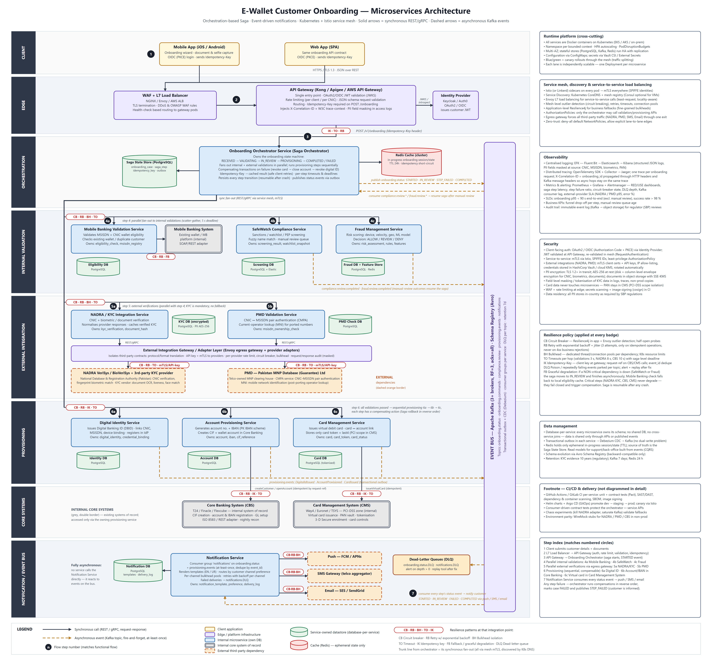

# E-Wallet Customer Onboarding — Microservices Architecture

Reference architecture for onboarding a new e-wallet customer end-to-end — identity verification, compliance and fraud checks, account provisioning and virtual-card issuance — as a set of independently scalable, observable and fault-tolerant microservices.

## Architecture diagram



- Full-resolution PNG: [`diagram/onboarding-architecture.png`](diagram/onboarding-architecture.png)
- Vector source: [`diagram/onboarding-architecture.svg`](diagram/onboarding-architecture.svg) (regenerate with `python diagram/generate_diagram.py`, then rasterise with a headless browser)

Reading the diagram: swimlanes run top-to-bottom in the order of the flow (Client → Edge → Orchestration → Internal Validation → External Integration → Provisioning → Core Systems → Notification / Event Bus). **Solid arrows are synchronous REST/gRPC calls; dashed arrows are asynchronous Kafka events.** Blue boxes are internal microservices (each with its own datastore), grey double-bordered boxes are internal core systems of record, orange dashed boxes are external third-party dependencies. Red pills mark the resilience patterns applied at that integration point (`CB` circuit breaker, `RB` retry with exponential backoff, `BH` bulkhead, `TO` timeout, `IK` idempotency key, `FB` fallback, `DLQ` dead-letter queue). Numbered circles match the steps below.

## End-to-end flow

| # | Step | Components | Style |
|---|---|---|---|
| 1 | Customer submits details + CNIC images / selfie from the mobile or web app, authenticated via OAuth2/OIDC (PKCE) and carrying an `Idempotency-Key`. | Mobile App, Web App | sync |
| 2 | Request passes the WAF + L7 load balancer into the **API Gateway**, which validates the JWT, rate-limits, schema-validates, enforces the idempotency key and injects correlation/trace headers. | Load Balancer, [API Gateway](services/api-gateway.md), Identity Provider | sync |
| 3 | Gateway calls the **Onboarding Orchestrator**, which persists the case in its Saga State Store, caches the in-progress session in Redis, publishes `OnboardingStarted` and begins the **orchestration-based Saga**. | [Onboarding Orchestrator](services/onboarding-orchestrator.md) | sync + async |
| 4 | Orchestrator fans out **internal validations in parallel** (scatter-gather): 4a [Mobile Banking Validation](services/mobile-banking-validation-service.md) (wallet eligibility vs the Mobile Banking System), 4b [SafeWatch Compliance](services/safewatch-compliance-service.md) (sanctions / watchlist / PEP), 4c [Fraud Management](services/fraud-management-service.md) (risk scoring). `REVIEW` outcomes park the saga in `IN_REVIEW`; analyst decisions come back as events. | Validation services | sync (results), async (review outcomes) |
| 5 | In parallel with step 4, **external verifications** run through the [External Integration Gateway](services/external-integration-gateway.md): 5a [NADRA / KYC Integration](services/nadra-kyc-integration-service.md) (CNIC + biometric / document verification with NADRA VeriSys / BioVeriSys or a KYC vendor), 5b [PMD Validation](services/pmd-validation-service.md) (CNIC–MSISDN pair authentication and operator lookup with PMD — Pakistan MNP Database (Guarantee) Ltd). | Integration services, external providers | sync |
| 6 | When **all** validations pass, provisioning runs **sequentially**, each step with a compensating action: 6a [Digital Identity](services/digital-identity-service.md) issues the Digital Banking ID → 6b [Account Provisioning](services/account-provisioning-service.md) generates account number + IBAN and registers the customer in the **Core Banking System** → 6c [Card Management](services/card-management-service.md) issues a virtual debit card in the **Card Management System**. Each publishes a domain event via a transactional outbox. | Provisioning services, Core Banking System, Card Management System | sync (calls), async (events) |
| 7 | The [Notification Service](services/notification-service.md) consumes every status event from the **Kafka event bus** (`STARTED`, `IN_REVIEW`, `STEP_FAILED`, `COMPLETED`, plus `CardIssued`) and informs the customer via push / SMS / email. Nothing calls it synchronously. Poison events land in dead-letter queues. | Notification Service, Kafka, channel providers | async |

Failure at any step: the orchestrator runs compensations in reverse order (revoke card → close account → revoke digital identity), marks the case `FAILED` and publishes `OnboardingStepFailed` / `OnboardingFailed`, so the customer is always told what happened.

## Service documentation

| Service | Lane | Document |
|---|---|---|
| API Gateway | Edge | [services/api-gateway.md](services/api-gateway.md) |
| Onboarding Orchestrator Service | Orchestration | [services/onboarding-orchestrator.md](services/onboarding-orchestrator.md) |
| Mobile Banking Validation Service | Internal validation | [services/mobile-banking-validation-service.md](services/mobile-banking-validation-service.md) |
| SafeWatch Compliance Service | Internal validation | [services/safewatch-compliance-service.md](services/safewatch-compliance-service.md) |
| Fraud Management Service | Internal validation | [services/fraud-management-service.md](services/fraud-management-service.md) |
| External Integration Gateway / Adapter Layer | External integration | [services/external-integration-gateway.md](services/external-integration-gateway.md) |
| NADRA / KYC Integration Service | External integration | [services/nadra-kyc-integration-service.md](services/nadra-kyc-integration-service.md) |
| PMD Validation Service | External integration | [services/pmd-validation-service.md](services/pmd-validation-service.md) |
| Digital Identity Service | Provisioning | [services/digital-identity-service.md](services/digital-identity-service.md) |
| Account Provisioning Service | Provisioning | [services/account-provisioning-service.md](services/account-provisioning-service.md) |
| Card Management Service | Provisioning | [services/card-management-service.md](services/card-management-service.md) |
| Notification Service | Notification / event bus | [services/notification-service.md](services/notification-service.md) |

Each document follows the same structure: Responsibility · APIs Exposed · Dependencies · Data Owned · Resilience & Failure Handling · Notifications Triggered.

## Key architectural decisions

| Concern | Decision |
|---|---|
| Workflow coordination | **Orchestration-based Saga** in the Onboarding Orchestrator: explicit state machine, parallel scatter-gather for validations, sequential provisioning, compensating transactions, resumable after crash. Chosen over choreography for auditability and a single place to reason about the flow. |
| Sync vs async | Request/response (REST/gRPC over the mesh) for steps whose result the saga needs immediately; **Kafka events** for status propagation, manual-review outcomes, provisioning domain events and all notifications. Producers use the **transactional outbox + Debezium CDC** pattern to avoid dual writes. |
| Entry point | API Gateway (Kong / Apigee / AWS API Gateway) behind a WAF + L7 load balancer: OAuth2/OIDC JWT validation, rate limiting, schema validation, mandatory `Idempotency-Key` on `POST /onboarding`. |
| Service discovery & mesh | Kubernetes CoreDNS + **Istio** (Envoy sidecars): mTLS everywhere, L7 service-to-service load balancing, outlier detection, `AuthorizationPolicy` so that only the orchestrator can call validation/provisioning APIs, egress gateway as the single exit for third-party traffic. |
| Resilience | Circuit breakers (Resilience4j + Envoy), retry with exponential backoff and jitter only on idempotent operations, per-dependency bulkheads, per-hop timeouts plus a saga deadline, dead-letter queues per topic, idempotency keys end-to-end (client key → `requestRef` on every downstream call → `event_id` inbox on consumers). |
| Graceful degradation | Non-critical checks (SafeWatch, Fraud, Mobile Banking eligibility) degrade to `IN_REVIEW` / cached results rather than failing the customer; **regulatory and core steps (NADRA KYC, PMD pairing, Core Banking, CMS) fail closed** and trigger compensation. Card issuance can be deferred without blocking account activation. |
| Data | **Database-per-service** (PostgreSQL schemas owned exclusively by each service; Elasticsearch/Redis where needed), no shared DB or cross-service joins; Redis holds only ephemeral in-progress onboarding state; Avro Schema Registry for event contracts. |
| Observability | EFK centralised logging (PII masked at source), OpenTelemetry → Jaeger tracing with one trace per onboarding case propagated through HTTP and Kafka headers, Prometheus + Grafana + Alertmanager for RED/USE metrics, saga step latency, breaker state, DLQ depth and provider SLAs. |
| Security | OAuth2/OIDC for clients; mTLS + SPIFFE identities between services; mTLS client certificates + API keys for NADRA/PMD; Vault/KMS-managed secrets; AES-256 at rest with column-level envelope encryption for CNIC/biometric/KYC data; field-level masking in logs, traces and non-prod; PAN confined to the PCI-DSS Card Management System. |
| Deployment | Docker containers on Kubernetes (one Deployment per service, HPA, multi-AZ). CI/CD footnote: GitHub Actions / GitLab CI → contract tests, SAST/DAST, image scanning and signing → Helm + Argo CD (GitOps) → canary via Istio. |

## Glossary

- **CNIC** — Computerised National Identity Card (Pakistan national ID number).
- **MSISDN** — the customer's mobile number.
- **NADRA** — National Database and Registration Authority; VeriSys / BioVeriSys are its citizen-verification and biometric-verification services.
- **PMD** — Pakistan Mobile Number Portability Database (Guarantee) Limited; the operator-owned MNP clearing house that also provides CNIC–MSISDN Pair Authentication (CMPA) and Mobile Network Identification (MNI) services to the financial industry.
- **SBP** — State Bank of Pakistan, the regulator whose branchless-banking / AML-CFT rules drive the KYC, pairing and retention requirements referenced in the service documents.

## Repository layout

```
README.md                         ← this file
diagram/
  onboarding-architecture.png     ← architecture diagram (raster, 2x)
  onboarding-architecture.svg     ← architecture diagram (vector)
  generate_diagram.py             ← generator for the SVG
services/
  api-gateway.md
  onboarding-orchestrator.md
  mobile-banking-validation-service.md
  safewatch-compliance-service.md
  fraud-management-service.md
  external-integration-gateway.md
  nadra-kyc-integration-service.md
  pmd-validation-service.md
  digital-identity-service.md
  account-provisioning-service.md
  card-management-service.md
  notification-service.md
```
